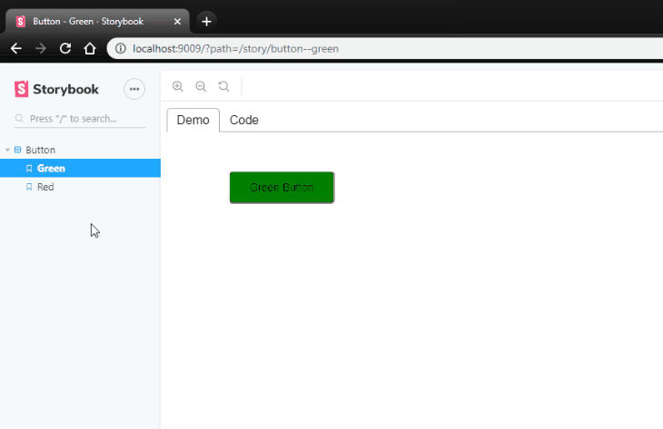

# React DemoTab CLI 📑

[![npm version][npm-badge]][npm-url]
[![build status][build-badge]][build-url]
[![oclif][oclif-badge]][oclif-url]
[![prettier][prettier-badge]][prettier-url]

_Easily create demos of react components_



Maintaining example code and demo separately makes it painful, it's easy to get them out of sync 🙅

Code can't lie, demo code can 💥

DemoTab CLI keeps your code up to date with demo 💪

## Install

```bash
npm install -D react-demo-tab react-demo-tab-cli
```

## Demo

**[DemoTab example](https://mkosir.github.io/react-demo-tab-cli)**

## Usage (3 steps)

To use CLI in your project:

1. default export react components that you wish to create demos of
1. name component file as **`[filename].demotab.[ext]`**
1. run **`$ npx demotab generate`**

#### Use created demos 🎉

## Generated DemoTab Files

- By default generated demos will be prefixed with `_` for example:  
  `MyComponent.demotab.jsx` & `MyComponent.demotab.css` -> `_MyComponent.jsx`
- You can set custom prefix with `--prefix` flag:  
  `$ demotab generate --prefix=CustomPrefix`

## Built with DemoTab

- React Tilt - [Repo](https://github.com/mkosir/react-parallax-tilt) - [DemoTab](https://mkosir.github.io/react-parallax-tilt)
- Mighty Mouse - [Repo](https://github.com/mkosir/react-hook-mighty-mouse) - [DemoTab](https://mkosir.github.io/react-hook-mighty-mouse)
- Magnetic Board - [Repo](https://github.com/mkosir/react-magnetic-board) - [DemoTab](https://mkosir.github.io/react-magnetic-board)

## Manually create demos

If you wish to manually create demos instead with CLI, see [React DemoTab](https://github.com/mkosir/react-demo-tab).

## License

[MIT](LICENSE)

[npm-badge]: https://img.shields.io/npm/v/react-demo-tab-cli.svg
[npm-url]: https://www.npmjs.com/package/react-demo-tab-cli
[build-badge]: https://travis-ci.com/mkosir/react-demo-tab-cli.svg
[build-url]: https://travis-ci.com/mkosir/react-demo-tab-cli
[oclif-badge]: https://img.shields.io/badge/cli-oclif-brightgreen.svg
[oclif-url]: https://oclif.io
[prettier-badge]: https://img.shields.io/badge/code_style-prettier-ff69b4.svg
[prettier-url]: https://github.com/prettier/prettier
